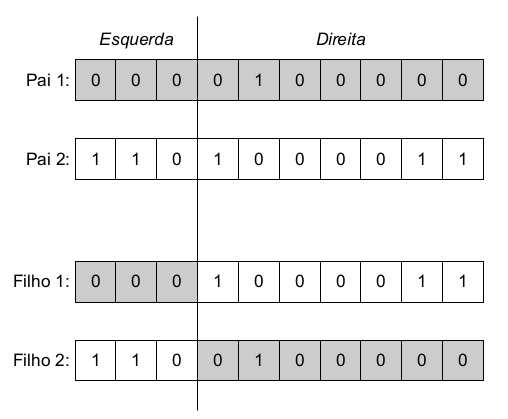
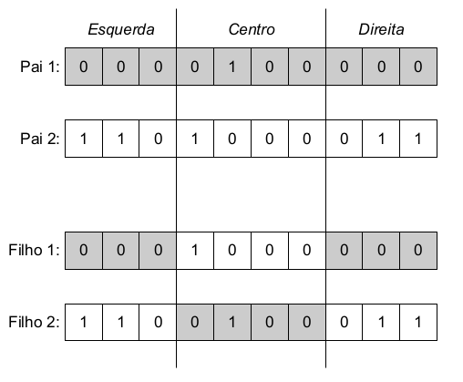
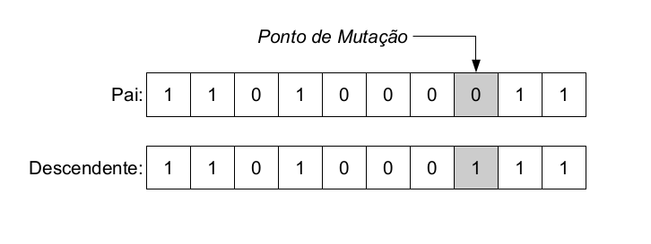

# AeroGA

Algoritmo heurístico de otimização single-objective utilizando conceitos evolutivos.

Para utilizar o GA deve-se fazer a importação do arquivo .py e todas suas funções, como mostrado abaixo:

~~~python
import AeroGA                              
~~~

# Etapas

### **1. Carregando variáveis**

As variáveis utilizadas no GA são repassadas através de uma estrutura. Para criar a estrutura é necessário importar a bibliotéca ypstruct, como mostrado abaixo:

~~~python
from ypstruct import structure                            
~~~

Para instalar a biblioteca ypstruct e todas as outras necessárias para rodar o código siga os passos mostrados na seção 'Instalando requirements' em Observações.

Variáveis relacionadas ao problema a ser resolvido

* **lb** - Lower Bounds
* **ub** - Upper Bounds
* **nvar** - Número de variáveis do problema
* **population_size** - Tamanho da população
* **num_generations** - Número de gerações
* **tournament_size** - Tamanho da lista torneio que será utilizada no método de seleção "tournament", utilizar mesmo número da populalção por padrão
* **eta** - Parâmetro referente a mutação Polynomial (Valores maiores representam taxas de mutações menores (Ex.: 20), valores menores representam mutação severas no indivíduos (Ex.: 1)). Para maiores informações ler o artigo [(HAMDAN & Mohammad, 2012)](https://d1wqtxts1xzle7.cloudfront.net/31582313/Main-libre.pdf?1392403242=&response-content-disposition=inline%3B+filename%3DThe_Distribution_Index_in_Polynomial_Mut.pdf&Expires=1676061047&Signature=OpI7L7smR9-jq8TBmTeknRwFK83SJz7bnQ0TcQepI4rMvB96v0BSCjhThyORfaaelhAUaSsUlvsLNvNdxlXgPd7UfReDimPBbPtW0RVeeLBWHdjulrTq3JsjqsaGgtRU55fMbAkhe0grDP8uQ2CDsSf8K58YgtikLSWc1lIfIpMGwxfKZodC2IqEOrUaicxh4kNQohiw9T-SjOcpmNKxpW5kYIDjR-lYWr8JfV1yRMDF07HLLf1GMbAgBIw0p47qdPEE0JJG3Q7QBKHtkxxvd7uU2l5g0aBfOoCc4XPQM9u31V2fRkOfXDTQK-h-IEIFqlczRANawigoD6vscTvtgw__&Key-Pair-Id=APKAJLOHF5GGSLRBV4ZA)
* **std_dev** - Desvio padrão aplicado no método de mutação Gaussiana
* **elite_count** - Número de indivíduos que serão passados para a próxima geração por meio elitista
* **online_control** - Uso do controle online de parâmetros (True ou False)
* **mutation_rate** - Taxa de mutação caso escolha False no controle online
* **crossover_rate** - Taxa de crossover caso escolha False no controle online

Devem ser definidas como no exemplo abaixo:

~~~python
param = structure()
param.lb = [0, 0, 0.0, 0.0, 0.0, 0.0]
param.ub = [5, 4, 0.4, 1.5, 0.5, 1.0]
param.num_variables = 6
param.population_size = 50
param.num_generations = 100
param.tournament_size = 50
param.eta = 20
param.std_dev = 1.8
param.elite_count = 2
param.online_control = True
param.mutation_rate = 0.2
param.crossover_rate = 1                              
~~~

Para definir os valores inteiros no GA deve-se usar no lb e ub valores como [0,4], para valores contínuos deve-se usar [0.0, 4.0]

Variáveis relacionadas aos métodos do GA

* **selection** - Método de seleção ("roulette", "rank", "tournament")
* **crossover** - Método de recombinação ("arithmetic", "1-point", "2-point")
* **mutation** - Método de mutação("gaussian", "default")
* **n_threads** - Número de Threads do processador que devem ser utilizadas para calcular aa função fitness

Devem ser definidas como no exemplo abaixo:

~~~python
methods = structure()
methods.selection = "tournament"
methods.crossover = "SBX"
methods.mutation = "gaussian"
methods.n_threads = 4                                                           
~~~

Para realizar a otimização deve-se chamar a função 'optimize' do AeroGA, como mostrado abaixo:

~~~python
out = AeroGA.optimize(methods, param, fitness_fn)                                                  
~~~

O dicionário *out* retorna os seguintes valores:

 * **genes** - Lista de indivíduos da última geração
 * **history** - Histórico de todos os indivíduos utilizados no GA
 * **best_individual** - Melhor indivíduo encontrado
 * **best_fit** - Lista de Melhores fitness encontrados por geração
 * **avg_fit** - Lista das médias de fitness encontrados por geração
 * **metrics** - Lista dos valores da métrica de diversidade por geração

### **2. Inicialização da População**

Etapa inicial do código, onde são gerados indivíduos com valores aleatórios e para cada um o valor de fitness é calculado.

### **3. Critérios de Seleção**

Os critérios de seleção são utilizados para selecionar os indivíduos que serão usados no crossover e mutação. Os critérios são feitos de modo que qualquer indivíduo possa ser escolhido porém aqueles com maior fitness, tem consequentemente a maior probabilidade de serem escolhidos para gerar filhos. Tal aspecto é importante pois havendo a possibilidade de indivíduos com baixo fitness mantém-se a diversidade da população, não descartando regiões do espaço de procura. Caso somente os melhores indivíduos passem adiante no processo a convergência se torna rápida e as chances do resultado cair em um máximo local são altas. 

 * **Roleta** - Neste método, cada indivíduo da população é representado na roleta proporcionalmente ao fitness. Assim, aos indivíduos com alto fitness é dada uma porção maior da roleta, enquanto aos de fitness baixo é dada uma porção relativamente menor da roleta. Finalmente, a roleta é girada um determinado número de vezes, dependendo do tamanho da população, e são escolhidos, como indivíduos reprodutores, aqueles sorteados na roleta.

 

 * **Ranking** - Método semelhante a roleta, a única diferença é que, ao invés da porção da roleta ser dada pelo valor do fitness considera-se a porcentagem do fitness em relação a soma de todos os valores. Desse modo, o método de ranking é mais democrático e dá mais chances aos indivíduos com menor fitness.

 * **Torneio** - O método do torneio seleciona aeatóriamente dois indivíduos e realiza um torneio entre eles, o vencedor é aquele com maior valor de fitness. Este é o método mais indicado para preservar a diversidade do algoritmo genético.

 

### **4. Recombinação (Crossover)**

O operador de recombinação é o mecanismo de obtenção de novos indivíduos pela troca ou combinação dos alelos de dois ou mais indivíduos. Fragmentos das características de um indivíduo são trocadas por um fragmento equivalente oriundo de outro indivíduo. O resultado desta operação é um indivíduo que combina características potencialmente melhores dos pais.

 * **SBX** - [Kalyanmoy et al., 2012](https://content.wolfram.com/uploads/sites/13/2018/02/09-6-1.pdf)

 * **Aritmética** - A recombinação aritmética cria novos alelos nos descendentes com valores intermediários aos encontrados nos pais. Define-se uma combinação linear entre dois cromossomos x e y, de modo a gerar um descendente z.

 * **1 ponto** - Na recombinação de 1 ponto, seleciona-se aleatoriamente um ponto de corte nos cromossomos, dividindo este em uma partição à direita e outra à esquerda do corte. Cada descendente é composto pela junção da partição à esquerda (direira) de um pai com a partição à direita (esquerda) do outro pai.

 * **2 pontos** - A recombinação de 2 pontos tem a mesma ideia da recombinação de 1 ponto, porém são escolhidos aleatoriamente dois pontos de corte nos cromossomos, dividindo o cromossomo em três partições.

### **5. Mutação (Mutation)**

O operador de mutação modifica aleatoriamente um ou mais genes de um cromossomo. Com esse operador, um indivíduo gera uma cópia de si mesmo, a qual pode sofrer alterações. A probabilidade de ocorrência de mutação em um gene é denominada taxa de mutação. Usualmente, são atribuídos valores pequenos para a taxa de mutação, uma vez que esse operador pode gerar um indivíduo potencialmente pior que o original.

 * *Mutação Polinomial* - Essa mutação segue a mesma distribuição de probabilidade do SBX.

 * *Mutação Gaussiana* - No caso da mutação Gaussiana, o valor incorporado no(s) alelo(s) é aleatório com média zero e desvio padrão σ.

### **6. Métricas de Qualidade**

 * Diversidade da população - A métrica de diversidade de população foi feita como descrito por [(Morrison & Jong, 2001)](https://www.researchgate.net/publication/221024170_Measurement_of_Population_Diversity).
 

### **7. Análise de Sensibilidade**

 * Pode ser feita através da função *sensibility*, onde utiliza-se o melhor indivíduo encontrado e a partir do incremento calcula-se a função fitness variando cada variável do indivíduo deixando as outras fixas.

~~~python                                                
increment=0.01
sensibility(out["best_individual"], fitness_fn, increment, min_values, max_values)
~~~
### **8. Controle Online de Parâmetros**

 * O controle online de parâmetros serve para variar ao longo do GA as taxas de crossover e mutação, de modo que, o crossover inicia baixo e tende a aumentar até chegar a 1 (100%) e a mutação começa alta e diminui até chegar a 0.2 (20%) na última geração. Essas medidas são propostas pois é interessante que inicialmente ocorrá a fase de máxima exploração do GA com mutação alta e ao final esse nível de exploração seja baixo, permitindo o GA desenvolver os indivíduos encontrados e ao invés de mutalos completamente.

### **9. Plots**

 * **BestFit x Generation** - Mostra o melhor resultado de Fitness ao longo das gerações do GA.

 * **Dispersão dos inputs** - Mostra as variáveis de entrada normalizadas e todos os pontos explorados pelo GA durante as gerações. O intúito desse gráfico é avaliar o quão bem o algoritmo está explorando o espaço de busca.

 * **Metrics x Generation** - Mostra os valores da métrica de diversidade ao longo das gerações do GA.

 * **Curvas paralelas** - tem o intuito de avaliar a convergência do GA.

# Observações

### **1. Instalando requirements.txt**

Para instalar todas as bibliotecas utilizadas, no terminal de comandos coloque o código abaixo:

~~~python
pip install -r requirements.txt
~~~

# Contato

Qualquer dúvidas sobre o código favor contatar o autor.

Autor: Krigor Rosa

Email: krigorsilva13@gmail.com

# Referências

GABRIEL, Paulo Henrique Ribeiro; DELBEM, Alexandre Cláudio Botazzo. Fundamentos de algoritmos evolutivos. 2008.

VON ZUBEN, Fernando J. Computação evolutiva: uma abordagem pragmática. Anais da I Jornada de Estudos em Computação de Piracicaba e Região (1a JECOMP), v. 1, p. 25-45, 2000.

MORRISON, Ronald W.; JONG, Kenneth A. De. Measurement of population diversity. In: International conference on artificial evolution (evolution artificielle). Springer, Berlin, Heidelberg, 2001. p. 31-41.

HAMDAN, Mohammad. The distribution index in polynomial mutation for evolutionary multiobjective optimisation algorithms: An experimental study. In: International Conference on Electronics Computer Technology (IEEE, Kanyakumari, India, 2012). 2012.
	