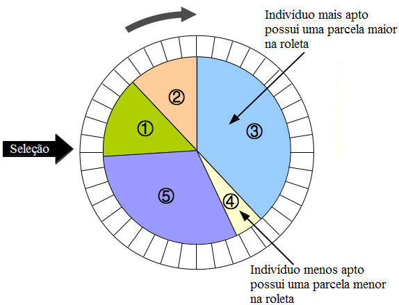
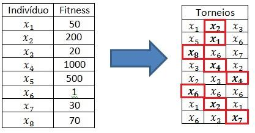

# AeroGA

Algoritmo heurístico de otimização single-objective utilizando conceitos evolutivos.

# Etapas

### **1. Carregando variáveis**

### **2. Inicialização da População**

Etapa inicial do código, onde são gerados indivíduos com valores aleatórios e para cada um o valor de fitness é calculado.

### **3. Critérios de Seleção**

Os critérios de seleção são utilizados para selecionar os indivíduos que serão usados no crossover e mutação. Os critérios são feitos de modo que qualquer indivíduo possa ser escolhido porém aqueles com maior fitness, tem consequentemente a maior probabilidade de serem escolhidos para gerar filhos. Tal aspecto é importante pois havendo a possibilidade de indivíduos com baixo fitness mantém-se a diversidade da população, não descartando regiões do espaço de procura. Caso somente os melhores indivíduos passem adiante no processo a convergência se torna rápida e as chances do resultado cair em um máximo local são altas. 

 * **Roleta** - Neste método, cada indivíduo da população é representado na roleta proporcionalmente ao fitness. Assim, aos indivíduos com alto fitness é dada uma porção maior da roleta, enquanto aos de fitness baixo é dada uma porção relativamente menor da roleta. Finalmente, a roleta é girada um determinado número de vezes, dependendo do tamanho da população, e são escolhidos, como indivíduos reprodutores, aqueles sorteados na roleta.

 * **Ranking** - Método semelhante a roleta, a única diferença é que, ao invés da porção da roleta ser dada pelo valor do fitness considera-se a porcentagem do fitness em relação a soma de todos os valores. Desse modo, o método de ranking é mais democrático e dá mais chances aos indivíduos com menor fitness.

 * **Torneio** - O método do torneio seleciona aeatóriamente dois indivíduos e realiza um torneio entre eles, o vencedor é aquele com maior valor de fitness. Este é o método mais indicado para preservar a diversidade do algoritmo genético.

 

### **4. Recombinação (Crossover)**

 * **Aritmética** 
 * **1 ponto** 
 * **2 pontos** 

### **5. Mutação (Mutation)**

### **6. Plots**

# Observações

### **1. Instalando requirements.txt**

Para instalar todas as bibliotecas utilizadas, no terminal de comandos coloque o código abaixo:

~~~python
pip install -r requirements.txt
~~~

### **2. Paralelização**

Opção de paralelização ainda não foi adicionada, o código AeroGA_parallel está em desenvolvimento.

# Contato

Qualquer dúvidas sobre o código favor contatar o autor.

Author: Krigor Rosa

Email: krigorsilva13@gmail.com
	